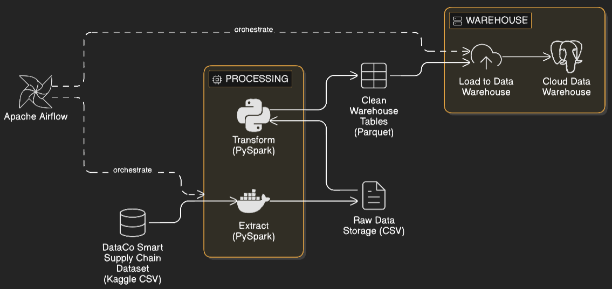
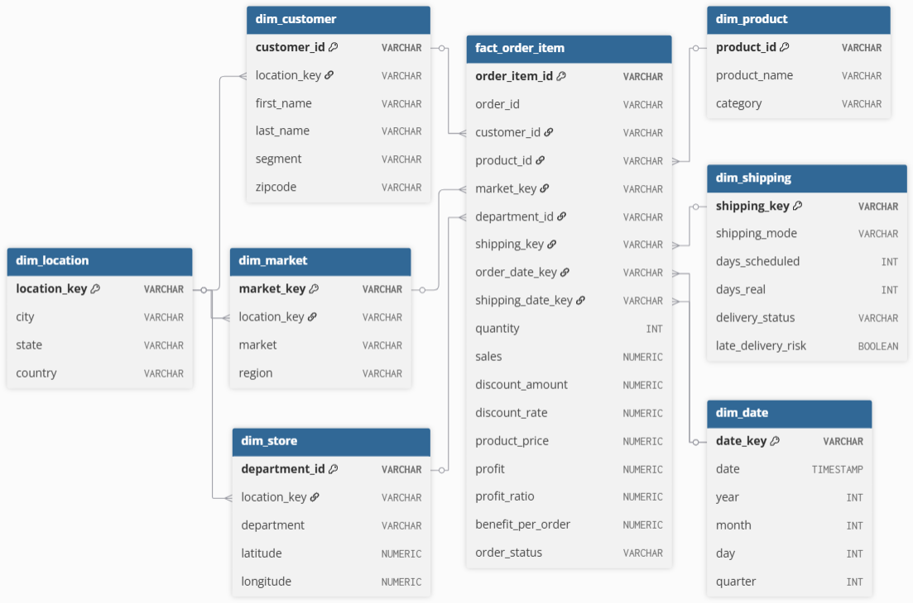

# Supply Chain Data Warehouse & ETL Pipeline

This project implements a cloud-based data warehouse and automated ETL pipeline designed for analytics on a global supply chain dataset.

## Architecture

## Features

Dimensional data model using Snowflake schema
Automated ETL pipeline with PySpark
Workflow orchestration using Apache Airflow
PostgreSQL cloud data warehouse

## Data Model

Fact Table

* orders

Dimension Tables

* customers
* products
* stores
* markets
* locations
* shipping
* dates

## Tech Stack

Python, PySpark, Apache Airflow, PostgreSQL, Docker